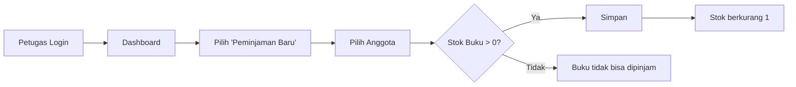
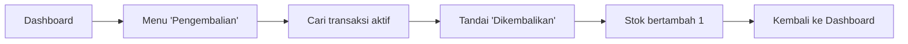
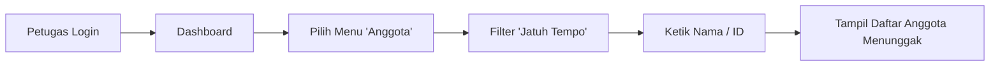

# Jobsheet 4 — Wireframe & User Flow

**SIMPUS-Mini** · Sistem Perpustakaan Mini

> Tidak ada kode HTML/CSS baru di jobsheet ini. Struktur tetap sama persis
> dengan jobsheet-03. Yang ditambahkan hanya dokumen rancangan ini —
> wireframe dan user flow untuk fitur **Petugas**, dipikirkan lebih dulu
> sebelum ditulis jadi kode.

---

## UI vs UX

| | UI — *User Interface* | UX — *User Experience* |
|---|---|---|
| **Definisi** | Tampilan: warna, tombol, tata letak, tipografi | Alur & rasa: mudah tidaknya pengguna menyelesaikan tugas |
| **Sudah dikerjakan sejak** | Jobsheet-02 (`style.css`) | Jobsheet-04 (dokumen ini) |
| **Analogi toko** | Penataan rak & etalase | Mudah tidaknya pelanggan menemukan barang lalu sampai ke kasir |

> Toko bisa terlihat cantik (UI bagus) tapi membingungkan untuk berbelanja
> (UX buruk) — atau sebaliknya.

---

## Aktor

| Aktor | Akses | Contoh Halaman |
|---|---|---|
| **Tamu** | Hanya melihat katalog, tanpa login | `index.html`, `buku/list.html` (jobsheet-01 s.d. 03) |
| **Petugas** | Login penuh, akses CRUD & transaksi peminjaman | Wireframe di bawah ini |

---

## Wireframe

### 1. Login Petugas

```
+--------------------------------------+
|              SIMPUS-Mini             |
|--------------------------------------|
|                                      |
|          [ Login Petugas ]           |
|                                      |
|   Username : [______________]        |
|   Password : [______________]        |
|                                      |
|            [    Masuk    ]           |
+--------------------------------------+
```

### 2. Dashboard Petugas

```
+-------------------------------------------------------------+
| SIMPUS-Mini   Beranda | Buku | Anggota | Peminjaman Logout  |
|-------------------------------------------------------------|
|  [Total Buku]   [Total Anggota]   [Sedang Dipinjam]         |
|                                                             |
|  Aksi Cepat:                                                |
|  [ + Peminjaman Baru ]   [ + Pengembalian ]                 |
|                                                             |
|  Transaksi Terbaru                                          |
|  Anggota | Buku | Tgl Pinjam | Status                       |
+-------------------------------------------------------------+
```

**Perubahan dari navbar Tamu:** menu "Tambah Buku" / "Tambah Anggota" yang
tadinya publik diganti satu menu baru **"Peminjaman"**, dan ditambah
**"Logout"** sebagai indikator sesi login.

---

## User Flow

### Peminjaman



### Pengembalian



> Aturan **stok > 0** sengaja ditulis sejak tahap rancangan, supaya
> tidak lupa diterapkan nanti saat coding.

---

## Kenapa dirancang dulu, bukan langsung coding?

| Kalau langsung coding | Kalau merancang dulu |
|---|---|
| Field apa saja? Urutannya bagaimana? Bagaimana kalau stok habis? Semua diputuskan sambil mengetik tag — satu kondisi penting mudah terlewat. | Alur dipikirkan utuh lebih dulu. Menemukan celah saat masih berupa teks jauh lebih murah daripada membongkar kode yang sudah jadi. |

**Fitur yang dirancang hari ini:** Login · Dashboard Petugas · Peminjaman · Pengembalian · Riwayat

---

## Tugas Mandiri


### 3. Wireframe Registrasi Anggota Baru

```
+---------------------------------------+
|              SIMPUS-Mini              |
|---------------------------------------|
|                                       |
|      [ Registrasi Anggota Baru ]      |
|                                       |
|   NIM / NIP     : [______________] *  |
|   Nama Lengkap  : [______________] *  |
|   Jenis Kelamin : (o) Laki-laki       |
|                   ( ) Perempuan       |
|   Program Studi : [-- Pilih Prodi- v] |
|   Email         : [______________]    |
|   No. WhatsApp  : [______________] *  |
|   Alamat        : [______________]    |
|                                       |
|   [ Batal ]              [ Simpan ]   |
|---------------------------------------|
|      Sudah punya akun? [ Login ]      |
+---------------------------------------+
```

### 4. User Flow: Mencari Anggota Lewat Jatuh Tempo

